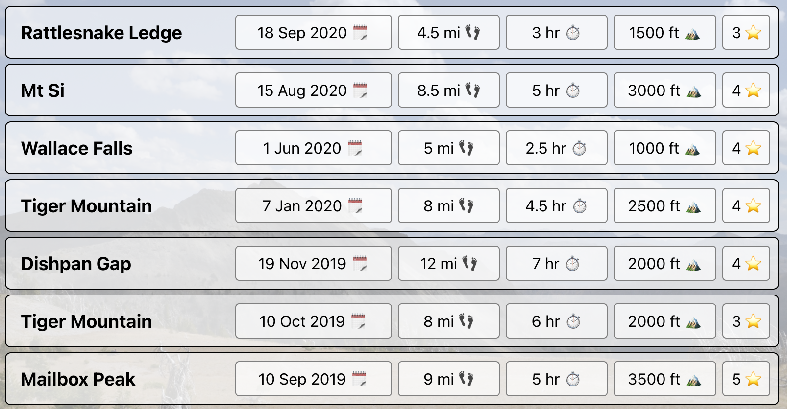
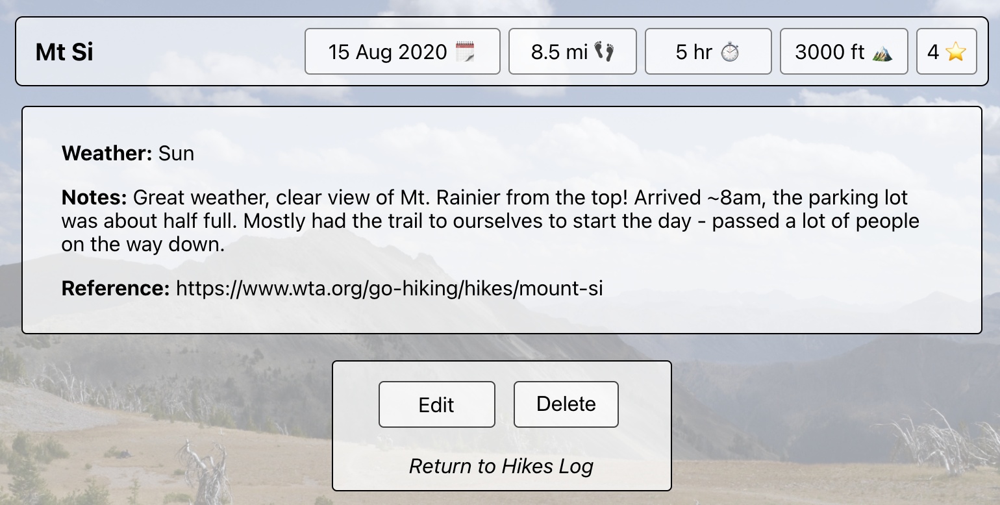
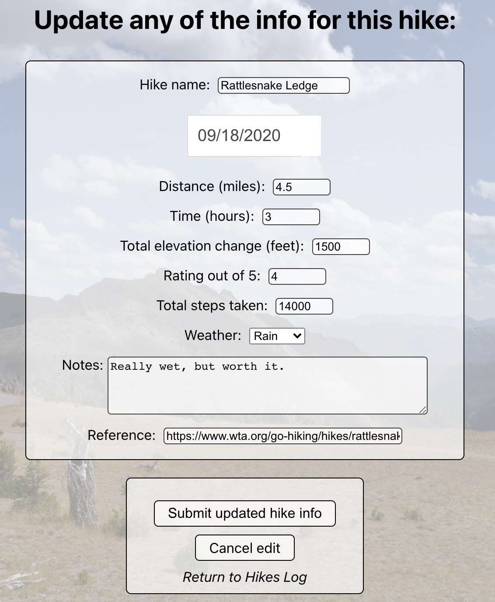
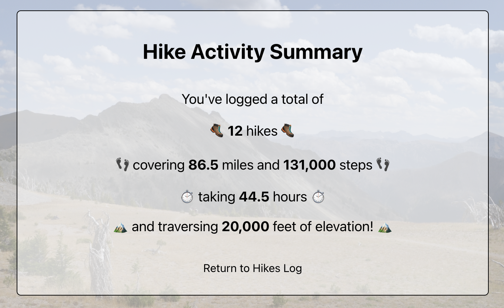

# HikeTracker

Use the Vercel-hosted app [here](https://hike-tracker.vercel.app/).

## General Description
*Track your hikes!* At a minimum, create a concise record of the hikes you've done. If you're interested in a more data-rich experience, log additional info about your hikes.

## Summary
Compile a clean, concise record of your hikes - when you hiked what trails.

You also have the option to track additional information about your hikes, including:
- Total mileage
- Total elevation change
- Time
- Weather
- Notes about the hike
- Link to a reference with info about the hike

Edit any information about any hikes, or delete the hike completely.

Easily access a summary of your logged hiking activity.

## Technology used
This project was bootstrapped with [Create React App](https://github.com/facebook/create-react-app), with elements of Javascript, JSX, HTML, and CSS.

## Contact me
You can find [my GitHub page here](https://github.com/sam1cutler).

## Acknowledgements
This project is a fullstack capstone project for the Thinkful software engineering program. 
